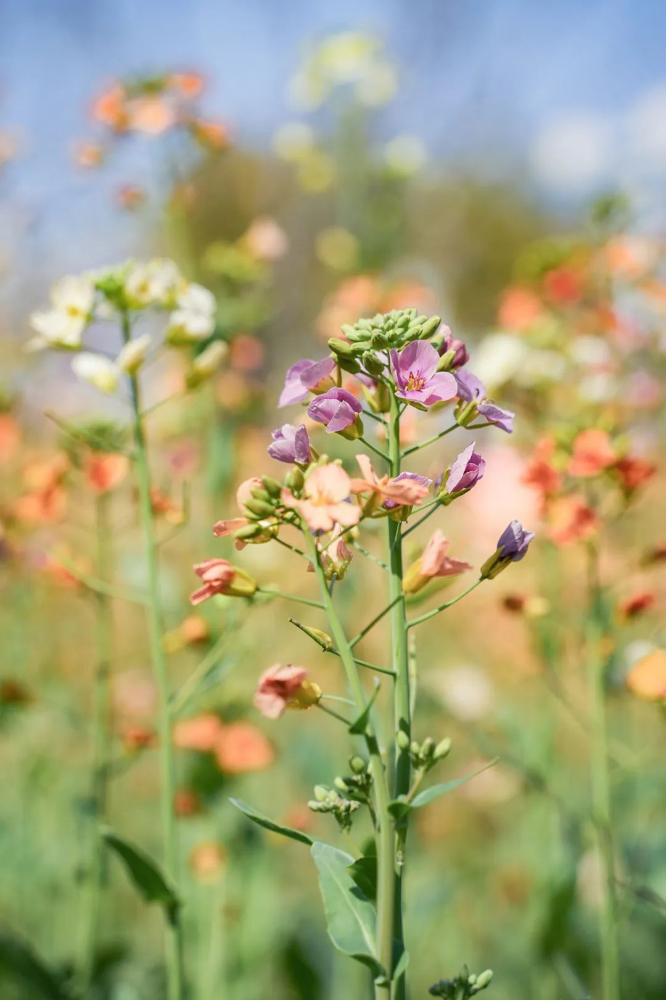

> [!tip]- 前言
> 人总以为自己未选择的路开满鲜花

深夜里忽然想起，年后那个太阳温柔的下午，和雨哥在成都的绿道上骑车，风中满是油菜花的清香，我俩走走停停，望着路旁的风景，说着多年未见的话，学校的日子仿佛还在昨天，生活的酸甜苦辣，又是新的一年。想象中的一切似乎并不遥远，现实却又清晰的摆在眼前。

我们路过一片五颜六色的油菜花，雨哥说：“这些就有意思一点，没必要都是黄色嘛，不同的颜色更好看不是吗？”我说：“对头。”每个人都有自己的颜色，每一株油菜花都有自己的春天。远处的池塘波光粼粼，春天凉爽的气息氤氲着大地流金的时光。拍照打卡的人们笑得很开心，油菜花们也很开心。

比起告别，我偏爱相聚，即使挥手，不要再见要你好。

